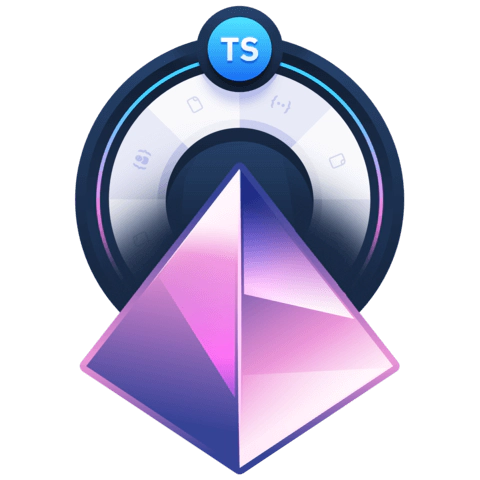

# egg-head-collection

- Cobble together hours-long videos, docs, tutorials, and forum posts
- Watch long, unedited videos at 2× speed
- Dig through the comments when tutorials give you more bugs than working code
- Read blog post after unreliable blog post
- Beg for answers on StackOverflow when you hit dead ends

## Menu

### React Optimization Cookbook

### Create a Digital Garden CLI with Rust

### Build a Backend with Prisma in a TypeScript Node Project

### Build a Modern User Interface with Chakra UI

### Craft Scalable, Custom-Made Interfaces with Tailwind CSS

### Deploy Dynamic Frontend Applications with Cloudflare Pages

### Create a TypeScript Powered Serverless React Application

### Sync State Across Components with Recoil in React

### Thinking Reactively with RxJS

### Build React Components from Streams with RxJS and Recompose

### Data Structures and Algorithms in JavaScript

### Just Enough Functional Programming in JavaScript

### Algorithms in JavaScript

### JavaScript Promises in Depth

### Understanding JavaScript's Prototypal Inheritance

### Use GraphQL Data Loaders to Prevent Scaling Issues by Batching & Caching Database Requests

### Transform Local JavaScript Functions into Serverless API Endpoints

### Build a GraphQL API with AWS CDK and AppSync

