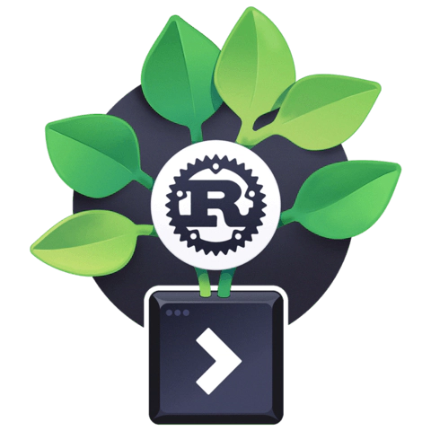
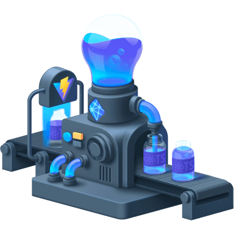

# egg-head-collection

- Cobble together hours-long videos, docs, tutorials, and forum posts
- Watch long, unedited videos at 2× speed
- Dig through the comments when tutorials give you more bugs than working code
- Read blog post after unreliable blog post
- Beg for answers on StackOverflow when you hit dead ends

## Menu

### React Optimization Cookbook

### Create a Digital Garden CLI with Rust

### Build a Modern User Interface with Chakra UI

### Craft Scalable, Custom-Made Interfaces with Tailwind CSS

### Deploy Dynamic Frontend Applications with Cloudflare Pages

### Create a TypeScript Powered Serverless React Application

### Sync State Across Components with Recoil in React

### Thinking Reactively with RxJS

### Build React Components from Streams with RxJS and Recompose

